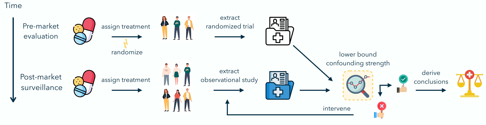

# Testing for Hidden Confounding in Observational Studies

[](https://arxiv.org/abs/2202.01315)
[](https://python.org/downloads/release/python-3115/)
[](https://pytorch.org/)
[](LICENSE)

This repository contains the Python implementation of [Hidden yet quantifiable: A lower bound for confounding strength using randomized trials](https://arxiv.org/abs/2202.01315).

* [Overview](#overview)
* [Getting Started](#getting-started)
* [Usage](#usage)
* [Contributing](#contributing)
* [License](#license)
* [Contact](#contact)
* [Citation](#citation)

## Overview

This repository implements the methods from the paper "Hidden yet quantifiable: A lower bound for confounding strength using randomized trials." The tools are designed for researchers in the field of epidemiology, enabling them to identify and lower bound the impact of unobserved confounding in observational studies. Unobserved confounders are variables that are not measured or accounted for in a study, but can significantly influence its outcomes, leading to biased results.

Our approach consists of two main components:

1. **Detection Test**: This component includes two statistical tests to detect the presence of unobserved confounding with strength above a given threshold. 

2. **Lower Bound Estimation**: This tool estimates a lower bound for the strength of unobserved confounding. This is key for distinguishing between _weak_ and _strong_ unobserved confounding. Establishing a lower bound helps in understanding how significantly unobserved confounding might alter the conclusions of the study, enabling practitioners to proactively reduce its impact.


Our tool becomes particularly useful in the context of drug regulation and post-marketing surveillance, where researchers often have access to data from a randomized trial and an observational study. It allows for a more rigorous analysis of the treatment's effectiveness and safety by quantifying the potential biases due to unobserved confounders.

<p align="center">
  
</p>

As depicted in the image above, the application of our methodology in the drug regulatory process enables a more informed and accurate assessment of medical treatments. By providing a way to quantify the influence of unobserved confounders, our tool aids in refining the conclusions drawn from observational studies.

## Getting Started

### Dependencies

- Python 3.11.5
- Numpy 1.24.3
- Scipy 1.10.1
- MLinsights 0.4.664
- Scikit-learn 1.3.0
- Statsmodels 0.13.5
- Pandas 1.5.3
- XGBoost 1.7.3
- Scikit-uplift 0.5.1
- Quantile-forest 1.2.0
- Torch 2.0.1
- CVXPY 1.3.1

### Installation

To set up your environment and install the package, follow these steps:

#### Create and Activate a Conda Environment

Start by creating a Conda environment with Python 3.11.5. This step ensures your package runs in an environment with the correct Python version. 
```bash
conda create -n myenv python=3.11.5
conda activate myenv
```
#### Install the Package

There are two ways to install the package:

1. **Local Installation:**
   If you have the package locally, upgrade `pip` to its latest version. Then, use the local setup files to install your package. This method is ideal for development or when you have the source code.
   ```bash
   pip install --upgrade pip
   pip install -e .
   ```
2. **Direct Installation from GitHub:**
   You can also install the package directly from GitHub. This method is straightforward and ensures you have the latest version.
   ```bash
   pip install git+https://github.com/jaabmar/confounder-lower-bound.git
   ```

#### Installing Dependencies for Unit Testing

To run the unit tests located in the `\tests` folder, you need to install additional dependencies. These dependencies are required for testing and ensure that you can run all the tests properly.
```bash
pip install -e .[tests]
```

## Usage

Example of using the package:

```bash
from test_confounding.CATE.cate_bounds import MultipleCATEBoundEstimators
from test_confounding.CATE.utils_cate_test import compute_bootstrap_variance
from test_confounding.datasets import synthetic
from test_confounding.test import run_multiple_cate_hypothesis_test

data = synthetic.Synthetic(
        num_examples_obs =  5000,
        num_examples_rct = 1000,
        gamma_star = 10.0,
        effective_conf = 1.0,
        sigma_y = 0.01,
        seed = 42,    
)

x_rct, t_rct, y_rct = (
  data.rct.x,
  data.rct.t,
  data.rct.y,
)

x_obs, t_obs, y_obs = (
    data.x,
    data.t,
    data.y,
)

ate = y_rct[t_rct == 1].mean() - y_rct[t_rct == 0].mean()
ate_variance = compute_bootstrap_variance(Y = y_rct, T = t_rct, n_bootstraps = 50, arm = None)

bounds_estimator = MultipleCATEBoundEstimators(
    gammas = [1.0, 3.0, 5.0, 7.0, 9.0, 11.0], n_bootstrap = 50
)

bounds_estimator.fit(x_obs=x_obs, t_obs=t_obs, y_obs=y_obs)

results_dict_cate = run_multiple_cate_hypothesis_test(bounds_estimator = bounds_estimator, ate = ate, ate_variance = ate_variance, alpha = 5.0, x_rct = x_rct, user_conf = [1.0, 3.0, 5.0, 7.0, 9.0, 11.0], verbose = False)
```

For detailed tutorials with synthetic and semi-synthetic data, refer to [Tutorial (Part 1)](src/synthetic.ipynb) and [Tutorial (Part 2)](src/semi_synthetic.ipynb).

## Contributing

We welcome contributions to improve this project. Here's how you can contribute:

1. Fork the Project
2. Create your Feature Branch (`git checkout -b feature/AmazingFeature`)
3. Commit your Changes (`git commit -m 'Add some AmazingFeature'`)
4. Push to the Branch (`git push origin feature/AmazingFeature`)
5. Open a Pull Request

## License

This project is licensed under the MIT License - see the [LICENSE](./LICENSE) file for details.

## Contact

For any inquiries, please reach out:

- Javier Abad Martinez - [javier.abadmartinez@ai.ethz.ch](mailto:javier.abadmartinez@ai.ethz.ch)
- Piersilvio de Bartolomeis - [pdebartol@ethz.ch](mailto:pdebartol@ethz.ch)

## Citation

If you find this code useful, please consider citing our paper:
 ```
@inproceedings{debartolomeis2023hidden,
  title={Hidden yet quantifiable: A lower bound for confounding strength using randomized trials},
  author={de Bartolomeis, Piersilvio^*, and Abad Martinez, Javier^* and Donhauser, Konstantin and Yang, Fanny},
  booktitle={Under Review},
  year={2023}
}
```